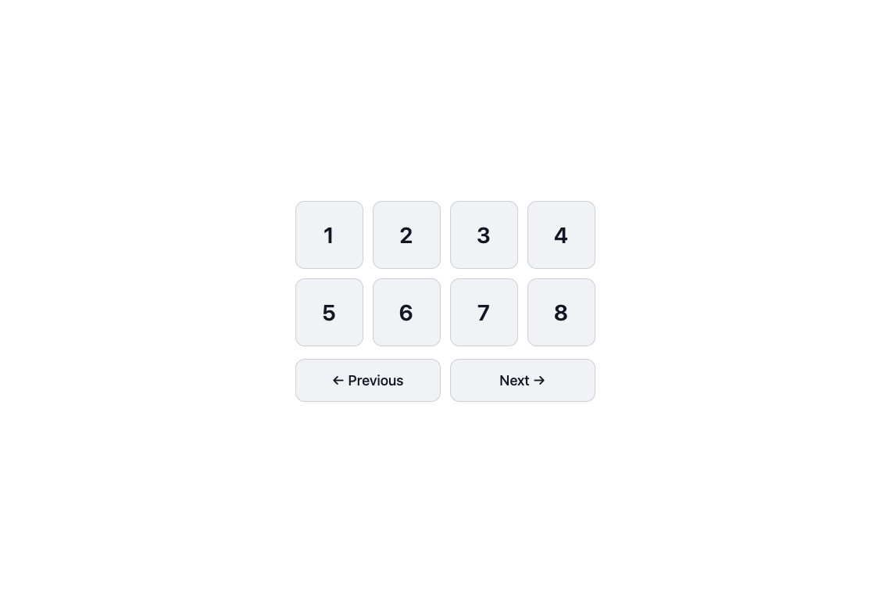

# Buttons on your own page

The control panel is one page. The buttons on it are ordinary requests to the HTTP listener, and those same URLs can sit on a page you already have. Your markup stays on your site. Each click asks the listener to change the switch.

```bash
tesmartctl listen --http 8080
```

A page opened on that computer uses `http://127.0.0.1:8080`. A page opened on another device needs the listener bound where that device can reach it:

```bash
tesmartctl listen --http 0.0.0.0:8080
```

and the address of the computer running `tesmartctl`, for example `http://192.168.1.20:8080`. There is no login. Keep the port on a network you trust. Full route detail is in [`listener.md`](listener.md).

`--panel` is required only for the iframe of the whole panel, further down. Input, next, previous, and peek work without it.

## A button is a link

A link or a form navigates to the listener. Aim it at a hidden iframe and the visitor stays on your page. This works when your page and the listener are different sites, because the browser is following a link, and the listener does not have to grant script access.

```html
<iframe name="tesmart" hidden></iframe>

<p>
  <a href="http://127.0.0.1:8080/input/1" target="tesmart">Input 1</a>
  <a href="http://127.0.0.1:8080/input/2" target="tesmart">Input 2</a>
  <a href="http://127.0.0.1:8080/input/3" target="tesmart">Input 3</a>
  <a href="http://127.0.0.1:8080/next" target="tesmart">Next</a>
  <a href="http://127.0.0.1:8080/previous" target="tesmart">Previous</a>
  <a href="http://127.0.0.1:8080/peek/3" target="tesmart">Peek at 3</a>
</p>
```

A form button is the same request:

```html
<form action="http://127.0.0.1:8080/input/3" method="get" target="tesmart">
  <button type="submit">Input 3</button>
</form>
```

Style those links and buttons in your own stylesheet. If the site already uses Bootstrap, `class="btn btn-primary"` on the link or button is enough.

A finished page of this kind is in [`examples/buttons/`](../examples/buttons/): `index.html` with eight input links plus Previous and Next, and `buttons.css` beside it. No script, no framework, nothing fetched beyond the listener. Copy the folder, change `127.0.0.1:8080` in the links to the address of the computer running `tesmartctl`, and open it.



The listener answers `{"active_input": 3, "requested": 3}`. Add `?format=text` and the body is `3` and a newline. That reply lands in the hidden iframe. A script on your page cannot read it when the iframe is another origin.

A name saved on the listener works in the path: `http://127.0.0.1:8080/input/Office`. Names live in the env file on the computer running `tesmartctl`, described in the README.

## Showing which input is active

`GET /input` returns `{"active_input": 2}`. `GET /status?network=0` returns the same input and skips the four LAN queries.

A script on your page can read that only when the page is served from the listener's own origin (same scheme, host, and port). The listener sends no `Access-Control-Allow-Origin` header. A page on any other origin is refused by the browser when it calls `fetch`. The listener has no login, so opening that header to every site would let any page a visitor opens change the switch.

Put your page and the listener on one origin with a reverse proxy, and the read is:

```javascript
const reply = await fetch("/input");
if (!reply.ok) {
  throw new Error(await reply.text());
}
const body = await reply.json();
// body.active_input is what the switch reports
```

The matching write is `fetch("/input/3")`, or `fetch("/input/3", { method: "POST" })`. GET and POST do the same thing on these routes.

The other arrangement is to keep the listener private and have your own server call it. The browser talks only to your server, and your server calls `http://127.0.0.1:8080/input/3`.

## The whole panel in a frame

```html
<iframe
  src="http://127.0.0.1:8080/panel"
  title="TESmart control"
  width="1100"
  height="800"></iframe>
```

Start the listener with `--panel`. The frame is the full control panel: inputs, names, cycle, switch settings, and the network card. It is sized as its own page. The listener does not send `X-Frame-Options`, so a frame on another origin can load it. Anyone who can open that frame can use everything on the panel, including **Change address**.

## Routes for a button

| Click | URL | Reply |
| --- | --- | --- |
| Select input 3 | `/input/3` | `{"active_input": 3, "requested": 3}` |
| Select by name | `/input/Office` | same, once `Office` is saved on the listener |
| Next in the saved cycle | `/next` | `{"previous": 2, "requested": 3, "active_input": 3}` |
| Previous | `/previous` | same shape |
| Next within a list, this click only | `/rotate?only=1,2,4` | same shape |
| Peek at 3 for the saved seconds | `/peek/3` | the peek result, sent once the switch is back |
| Peek for 8 seconds | `/peek?input=3&seconds=8` | same |

`/rotate` is the same as `/next`. `active_input` is the input the switch reports after the command. Compare it with `requested` when the two might differ.

`/peek/3` holds the request open until the switch has returned, so that iframe stays busy for those seconds. Selecting another input while a peek is still running leaves the new input selected. The peek treats that as an outside change and does not flip back over it.

Buzzer, front-panel display timeout, auto input detection, and the LAN address are not on these URLs. Those are the command line, or the panel and its `/api` routes when the listener was started with `--panel`. See [`panel.md`](panel.md).

## What the visitor will see when it fails

| Status | Meaning |
| --- | --- |
| 200 | the switch accepted the command, or `/input` was a read |
| 400 | the number is missing, out of range, or the switch rejected it |
| 404 | the path is not a route |
| 502 | the listener could not reach the switch |

The body is `{"error": "..."}`, or that message as plain text when the URL has `?format=text`.

The switch drops commands sent faster than about once a second. The listener queues them on one connection and waits that long between writes, so a row of rapid clicks still applies, one after another.
