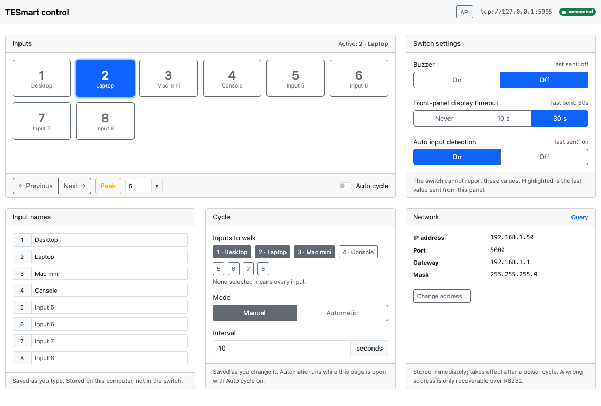
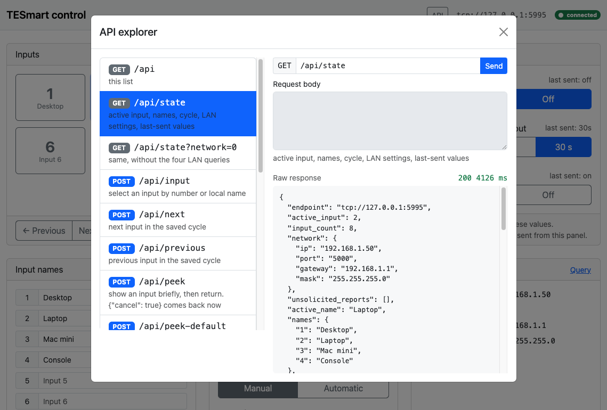

# tesmartctl

Command-line, HTTP, and browser control for TESmart 8×1 and 16×1 HDMI switches (HSW0801, HKS0801, HSW1601, HKS1601 and the same protocol family). It talks to the switch over its LAN port or the 3-pin RS232 port.

This is an independent project. It is not published by, or affiliated with, TESmart.

LAN control uses only the Python standard library. RS232 needs `pyserial`. Python 3.10 or newer. Licensed under the [MIT License](LICENSE).

## What it does

| | |
| --- | --- |
| Read | Active input, and the IP, port, gateway, and mask stored in the switch |
| Switch | Select an input by number or by a local name, or step next and previous through a list you choose |
| Peek | Show another input for a few seconds, then return. Not a cycle |
| Cycle | Walk a chosen list by hand (`next` / `previous`) or on a timer (`cycle run`) |
| Settings | Buzzer, front-panel display timeout, auto input detection. The switch cannot report these back |
| Address | Change the switch's IP, port, gateway, and mask, with two warnings and a read-back. Applied only after a power cycle |
| Listen | Keep one connection open: a line protocol on stdin or TCP, or HTTP URLs for Stream Deck, Companion, Home Assistant, and similar |
| Panel | Optional browser page at `/panel` (`listen --http PORT --panel`), including an API explorer |

The switch cannot say which HDMI inputs have a signal. A cycle is the list you configure, stored on this computer, not in the switch. Local input names are stored the same way.

| Document | What it covers |
| --- | --- |
| This file | Install, configuration, every command |
| [`Docs/protocol.md`](Docs/protocol.md) | Byte protocol the switch speaks |
| [`Docs/listener.md`](Docs/listener.md) | Long-running line protocol and HTTP URLs |
| [`Docs/panel.md`](Docs/panel.md) | Browser control panel at `/panel` |
| [`Docs/embed.md`](Docs/embed.md) | Input buttons on a page you already have |

## Install

```bash
git clone https://github.com/WBEVAN/TESmartController.git
cd TESmartController
pip install .                 # adds the tesmartctl command
pip install '.[serial]'       # also installs pyserial, for the RS232 port
pip install -e .              # editable: edits in this tree take effect immediately
```

Without installing, run from the repository directory:

```bash
python3 -m tesmart status
```

If the shell cannot find `tesmartctl` after install, open a new shell, or rehash your version manager. Requires Python 3.10 or newer.

## Help and examples

Every command prints worked examples at the end of its `--help`:

```bash
tesmartctl --help              # command list plus the most common invocations
tesmartctl input --help        # flags and examples for one command
tesmartctl net set --help
tesmartctl examples            # every example for every command, in one listing
```

The same examples appear in this README. They are generated from one table (`tesmart/examples.py`), so the terminal and the docs agree.

## Quick start: change inputs

From the command line:

```bash
tesmartctl input 3          # switch to HDMI 3
tesmartctl input Office     # switch by a local name (see `tesmartctl name`)
tesmartctl next             # next input in the saved cycle
tesmartctl peek 2           # look at HDMI 2 for 5 seconds, then come back
tesmartctl input            # which input is active now
```

From a URL, after starting the HTTP listener once (for example as a login item or a service):

```bash
tesmartctl listen --http 0.0.0.0:8080      # add --panel for the browser control panel
```

```text
http://<host>:8080/input/3                 switch to HDMI 3
http://<host>:8080/input/Office            switch by local name
http://<host>:8080/next                    next input in the saved cycle
http://<host>:8080/previous                previous input
http://<host>:8080/peek/2?seconds=8        look at HDMI 2 for 8 seconds, then come back
http://<host>:8080/input                   read the active input, {"active_input": 3}
http://<host>:8080/input?format=text       same, as a bare number
```

`<host>` is the machine running `tesmartctl`, not the switch. Use `127.0.0.1` with a port-only `--http 8080` when the controller runs on the same computer. Use `0.0.0.0:8080` to accept other devices on your network. The listener has no authentication, so only expose it to a network you trust.

### Stream Deck, macro pads, and home control

Each input change is one URL or one command, so anything that can open a URL or run a shell command can drive the switch:

| Controller | How to wire one button |
| --- | --- |
| Elgato Stream Deck | **Website** action with `http://127.0.0.1:8080/input/3` and "GET request in background" ticked, or a **System > Open** action running `tesmartctl input 3`. |
| Bitfocus Companion | **Generic HTTP**, GET `http://<host>:8080/input/3`. |
| Home Assistant | A `rest_command` (`url: http://<host>:8080/input/{{ input }}`) called from a button, script, or automation. A `rest` sensor on `/input?format=text` shows the active input. |
| Homebridge / HomeKit | An HTTP switch or button plugin pointed at `/input/N`, one accessory per input. |
| Node-RED | An **http request** node, GET `/input/3`. |
| Apple Shortcuts | **Get Contents of URL** with `http://<host>:8080/input/3`. |
| Keyboard Maestro, Hammerspoon, cron | Run `tesmartctl input 3`, or `curl -s http://127.0.0.1:8080/input/3`. |

Home Assistant example (`configuration.yaml`):

```yaml
rest_command:
  tesmart_input:
    url: "http://192.168.1.20:8080/input/{{ input }}"
  tesmart_peek:
    url: "http://192.168.1.20:8080/peek/{{ input }}?seconds={{ seconds | default(5) }}"

sensor:
  - platform: rest
    name: TESmart active input
    resource: "http://192.168.1.20:8080/input?format=text"
    scan_interval: 10
```

Here `192.168.1.20` stands for the computer running the listener. Every response says which input the switch actually reports (`active_input`), so a controller can show the real state rather than assuming the switch obeyed. See [Listener](#listener) for every route.

## Connection

The switch's factory address is `192.168.1.10`, TCP port `5000`. You can move it to another address on your network with `tesmartctl net set`. After that, save the new address as the CLI default so later commands do not need `--host`.

Each setting (`host`, `port`, `serial`, `inputs`) is resolved in this order:

1. Command-line flag (`--host`, `--port`, `--serial`, `--inputs`)
2. Env file `~/.config/tesmartctl/env` (override the path with `--env-file` or `TESMART_ENV_FILE`)
3. Environment variable, only when it is set (`TESMART_HOST`, `TESMART_PORT`, `TESMART_SERIAL`, `TESMART_INPUTS`)
4. Built-in default (`192.168.1.10`, `5000`, no serial device, `8` inputs)

```bash
tesmartctl config show                     # effective values and where each came from
tesmartctl config set host 192.168.1.50    # also: port, serial, inputs
tesmartctl config unset host
tesmartctl config path
```

Input names are local. The switch cannot store them. They are written to the same env file as `TESMART_NAME_1=Office` and appear in `status`, `input`, and `rotate`.

```bash
tesmartctl name set 2 Office
tesmartctl name set 1 "Living room"
tesmartctl name list
tesmartctl name unset 1
tesmartctl input Office          # select by the local name
```

The env file is plain `KEY=VALUE` lines (`TESMART_HOST=192.168.1.50`) and can be edited by hand. `--serial /dev/tty.usbserial-xxx` uses RS232 at 9600 8N1 instead of LAN. `--inputs 16` is for a 16×1. `--timeout 1.5` is how long a reply is awaited. `--json` prints JSON from the one-shot commands.

Global flags go before the subcommand: `tesmartctl --host 192.168.1.50 status`.

## What the switch will report

| Setting | Read | Write |
| --- | --- | --- |
| Active input (1–8, or 1–16) | yes | yes, and the switch reports the input it actually selected |
| LAN IP, TCP port, gateway, mask | yes | yes, applied only after a power cycle |
| Buzzer | no | yes |
| Front-panel LED timeout (never, 10s, 30s) | no | yes |
| Auto input detection | no | yes |

Buzzer, LED timeout, and auto-detect accept a set command and send nothing back. A successful command means the bytes were sent, not that the value was read back.

The switch drops or garbles commands sent faster than about once a second. `tesmartctl` waits that long between writes on one connection.

This is an 8-input, 1-output switch. The protocol can read the selected input and cannot read which inputs have a signal, so it cannot calculate which sources are connected. The front-panel LEDs show that locally. `rotate` therefore walks every input from 1 to 8, or an explicit list you pass with `--only`.

## Commands

### Read

```bash
tesmartctl status                 # active input plus saved LAN settings
tesmartctl status --json
tesmartctl status --no-network    # skip the four LAN queries
tesmartctl input                  # active input only
tesmartctl net show               # IP, port, gateway, mask
tesmartctl monitor                # print the input whenever it changes
```

`status` looks like:

```text
Endpoint:      tcp://192.168.1.50:5000
Active input:  2 (Office) of 8
Input names (stored locally, not on the switch):
  1  Living room
  2  Office
Network (persisted; applied after power cycle):
  IP:          192.168.1.50
  Port:        5000
  Gateway:     192.168.1.1
  Mask:        255.255.255.0
Cycle:         manual (next/previous); 1, 2, 4 (chosen inputs)
Peek:          5s on another input, then back (`peek N`)
```

The cycle is stored on this machine. `manual` moves only when you ask for `next` or `previous`. `automatic` is the same list on a timer, and it starts only while `cycle run` is running. With no saved list the cycle is every input.

Peek is not a cycle. `peek 3` shows input 3 for a few seconds and then returns to the input that was active. The duration is stored on this machine.

`monitor` stays running and prints a new line when the front panel, the remote, auto-detect, or another client changes the input. Ctrl-C stops it.

### Change the input

```bash
tesmartctl input 3                # switch to HDMI 3 and read it back
tesmartctl input 3 --no-verify    # send the command and do not read it back
tesmartctl cycle inputs 1,2,4              # save the inputs to walk
tesmartctl cycle mode manual               # next and previous only
tesmartctl next                            # Office -> next chosen input
tesmartctl previous
tesmartctl cycle mode automatic --every 15 # then start the timer:
tesmartctl cycle run
tesmartctl --json input 3
```

Inputs are 1-based. The command exits non-zero when the switch reports a different input than the one requested. `input 9` is rejected locally and is not sent.

### Peek at another input

```bash
tesmartctl peek 3                 # show input 3 for 5 seconds, then come back
tesmartctl peek Office --seconds 10
tesmartctl peek 3 --seconds 8 --save   # and make 8 seconds the default
```

`peek` flips to the input, waits, and flips back to the one that was active. Ctrl-C comes back at once. If the input is changed by something else during the peek (front panel, remote, another client), `peek` leaves that choice alone, reports it, and exits non-zero. The default duration is `5` seconds, stored as `TESMART_PEEK_SECONDS` in the env file.

### Write-only settings

```bash
tesmartctl buzzer off             # on | off
tesmartctl led 10                 # never | 10 | 30   (seconds)
tesmartctl autodetect on          # on | off
```

Accepted words for on/off also include `1`/`0`, `true`/`false`, `enable`/`disable`, `unmute`/`mute`.

### LAN address

```bash
tesmartctl net set \
  --ip 192.168.1.50 --gateway 192.168.1.1 --mask 255.255.255.0 --yes
tesmartctl net show               # read the stored values back before rebooting
```

`--tcp-port` sets the switch's own listen port (factory `5000`). Each value is stored immediately and used only after the switch is power-cycled. There is no factory reset for these settings.

**Risk notice.** A wrong IP address, port, gateway, or mask makes the switch unreachable over the network, and recovery is only possible with a serial (RS232) cable. This software sends the values exactly as entered; it cannot check that they are valid for your network, cannot undo the change, and cannot recover a switch that is no longer reachable. You change these settings at your own risk. This software and its authors accept no liability for any loss, damage, downtime, or cost that results from doing so.

`net set` warns twice: without `--yes` it prints the notice and refuses; with `--yes` it prints the notice again, writes, then reads every value back from the switch and reports whether each one is `stored` or a `MISMATCH`. The exit code is `0` only when every value reads back as requested. Until the switch is power-cycled it keeps answering on its current address, so a mismatch can still be corrected.

`--save-default` writes the new `--ip` and `--tcp-port` into the CLI env file after the read-back confirms them, so later commands follow the switch to the new address.

### Raw bytes

```bash
tesmartctl raw AA BB 03 10 00 EE
# Sent:     AA BB 03 10 00 EE
# Received: AA BB 03 11 01 EE
#   frame cmd=0x11 value=0x01 term=0xEE -> input 2
```

`--listen 3` waits longer for the reply. See [`Docs/protocol.md`](Docs/protocol.md) for the frame layout. The input query value is 0-based in the reply (`0x01` is input 2).

## Listener

`listen` keeps one connection open. Use it when something else (a script, `nc`, a browser, a home-automation "open URL" action) needs to change inputs without starting a new process each time. Full detail is in [`Docs/listener.md`](Docs/listener.md).

```bash
tesmartctl listen                         # one command per line on stdin
printf 'get\nset 3\nquit\n' | tesmartctl listen

tesmartctl listen --bind 9753             # raw TCP on 127.0.0.1:9753
echo set 4 | nc 127.0.0.1 9753            # prints the input the switch reports

tesmartctl listen --http 8080             # HTTP on http://127.0.0.1:8080/
tesmartctl listen --http 8080 --panel     # also http://127.0.0.1:8080/panel
```

`--bind` and `--http` cannot be combined. Run two processes if you want both. A port number alone binds `127.0.0.1`. `0.0.0.0:8080` accepts other machines. There is no authentication.

`--panel` is off unless you add it. It serves a browser page for selecting inputs, stepping the cycle, peeking, and the switch settings the vendor Windows controller exposes (buzzer, front-panel display timeout, auto input detection, LAN address). Detail is in [`Docs/panel.md`](Docs/panel.md).



The **API** button in the top bar opens an explorer that lists every `/api` route, sends it, and shows the raw status and body the listener returned.



Line commands: `get` (also `port`, `status`, `?`) prints the active input; `set 3`, `set Office`, or just `3` switches and prints the input the switch reports; `next` or `rotate 1,2,4` moves to the next input; `peek 3` or `peek 3 10` shows an input briefly and replies once back; `quit` closes the session. `--json` makes each reply one JSON object. The line command `status` is only the active input. The full readable status is the HTTP route and `tesmartctl status`.

A full session on stdin:

```text
$ tesmartctl listen
Command listener on stdin for tcp://192.168.1.50:5000 (Ctrl-C or 'quit' to stop).
commands: get | set <n> | <n> | next | previous | rotate [1,2,4] | peek <n> [seconds] | quit
get
2
set 3
3
Office
2
next
3
quit
```

HTTP routes, GET or POST:

```text
http://127.0.0.1:8080/                       list of routes
http://127.0.0.1:8080/input                  {"active_input": 2}
http://127.0.0.1:8080/status                 input plus saved IP, port, gateway, mask
http://127.0.0.1:8080/status?network=0       input only, skips the LAN queries
http://127.0.0.1:8080/status?format=text     same fields as plain lines
http://127.0.0.1:8080/rotate                 next input; {"previous": 2, "active_input": 3}
http://127.0.0.1:8080/rotate?only=1,2,4     next input within that list
http://127.0.0.1:8080/input?rotate=1        same as /rotate
http://127.0.0.1:8080/peek/3                 show 3 for the saved seconds, then back; replies once back
http://127.0.0.1:8080/peek?input=3&seconds=8 same with an explicit duration
http://127.0.0.1:8080/input?set=3            {"active_input": 3, "requested": 3}
http://127.0.0.1:8080/input/3                same as /input?set=3
http://127.0.0.1:8080/input/Office           switch by a local name
http://127.0.0.1:8080/set?input=3            same as /input?set=3
http://127.0.0.1:8080/get                    same as /input
http://127.0.0.1:8080/input/3?format=text    3
```

`active_input` is what the switch reports after the change. Compare it with `requested` when they might differ. `400` is a bad number or a switch rejection, `404` is an unknown route, `502` means the switch connection failed. `/status` takes a few seconds because each LAN query is paced.

## Library

```python
from tesmart import TcpTransport, TesmartSwitch, LedTimeout

with TesmartSwitch(TcpTransport("192.168.1.50")) as sw:
    print(sw.get_active_input())
    sw.set_input(4)
    sw.set_buzzer(False)
    sw.set_led_timeout(LedTimeout.SECONDS_30)
    sw.set_auto_detect(True)
    print(sw.read_status())
```

`SerialTransport("/dev/tty.usbserial-xxx")` is the RS232 equivalent and imports `pyserial`.

## Layout

| Path | Responsibility |
| --- | --- |
| `tesmart/protocol.py` | Hex and ASCII encode/decode, no I/O |
| `tesmart/transport.py` | TCP and serial transports |
| `tesmart/switch.py` | Device operations, receive buffer, command pacing |
| `tesmart/config.py` | Flag, env file, environment variable, default |
| `tesmart/peek.py` | Peek: flip to an input, wait, flip back |
| `tesmart/listener.py` | Stdin and raw-TCP command listener |
| `tesmart/web.py` | HTTP routes |
| `tesmart/panel.py` | `/panel` and its `/api` routes, only with `--panel` |
| `tesmart/static/` | Panel HTML, CSS, and JS |
| `tesmart/cli.py` | `tesmartctl` argument parsing and output |
| `tesmart/examples.py` | Worked examples shown by `--help` and `tesmartctl examples` |
| `Docs/protocol.md` | Wire protocol |
| `Docs/listener.md` | Line protocol and HTTP routes |
| `Docs/panel.md` | Browser control panel |
| `Docs/embed.md` | Input buttons on another page |
| `examples/buttons/` | Sample page of input links, no script or framework |
| `Docs/images/` | Screenshots used in the documentation |
| `LICENSE` | MIT License |

## License

[MIT](LICENSE). This software is provided as is, without warranty. Changing the switch's network address can make it unreachable over the LAN; that risk, and the absence of any liability for it, is spelled out in [LAN address](#lan-address) and in the panel before a write is accepted.
